# 工厂仓库 ERP 管理系统

基于 PHP 8.2 + MySQL 的工厂仓库 ERP 管理系统，部署为网站形式，开箱即用。
首次访问通过部署引导配置数据库与管理员账号，完成后即可使用全部功能。
纯原生 PHP OOP 实现，不依赖任何框架、无前端构建步骤，便于二次开发与定制。

## ✨ 功能特性

- **入库 / 出库管理**：待办流程（待入库/待出库 → 完成后才动库存）、库存自动联动、库存不足拦截、入库退回 / 出库反回
- **生产管理**：BOM 生产方案、任务下发到产线、开始生产自动领料出库、完工自动成品入库、取消生产按比例退料、材料快照
- **库存管理**：实时库存查询、低库存预警（全局阈值 + 商品级最低库存）
- **退回管理**：入库退回 / 出库反回的统一待办中心，完成后才实际变动库存
- **报表统计**：按日期查询出入库汇总与明细，支持打印
- **权限体系**：模块级 + 操作级细粒度权限、权限变更日志、菜单按权限显示
- **部署引导**：首次访问自动建库建表 + 创建管理员，开箱即用
- **安全机制**：PDO 预处理防注入、CSRF 校验、XSS 过滤、密码哈希、会话安全

## 📷 界面预览

| 登录 | 仪表盘 |
| --- | --- |
| 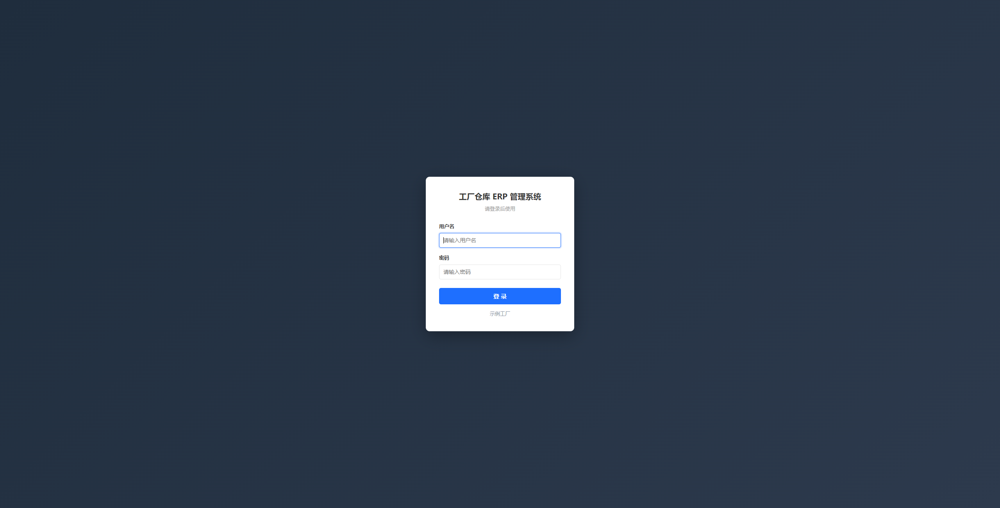 | 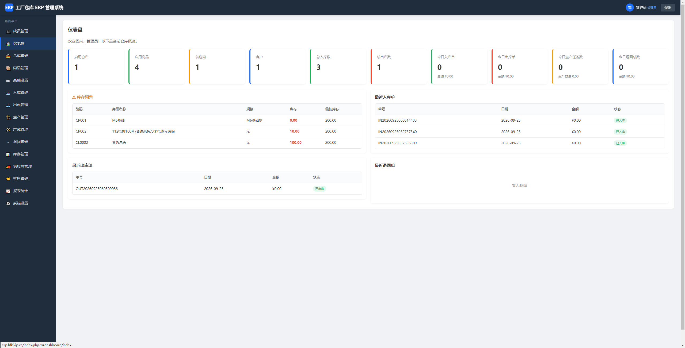 |

| 入库管理 | 出库管理 |
| --- | --- |
| 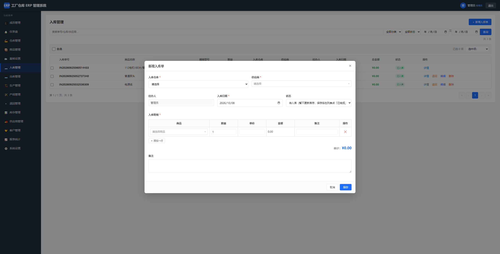 | 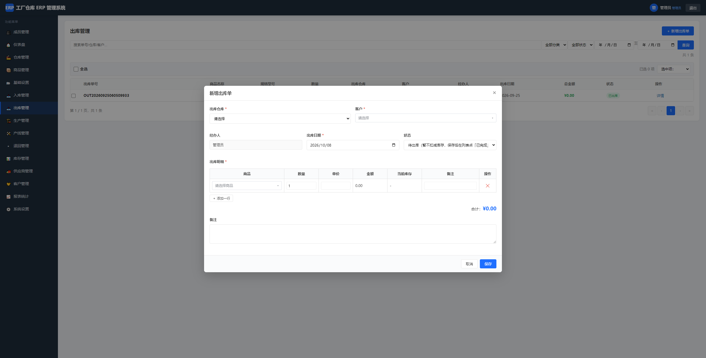 |

| 生产管理 | 设置生产配方 |
| --- | --- |
| 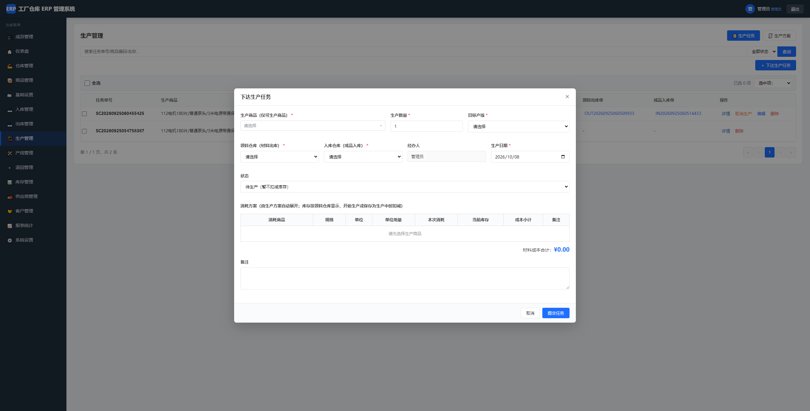 | 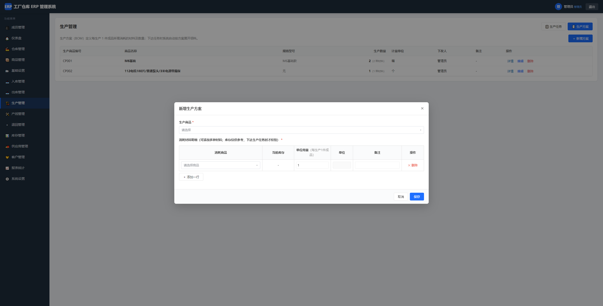 |

| 产线管理 | 退回管理 |
| --- | --- |
| 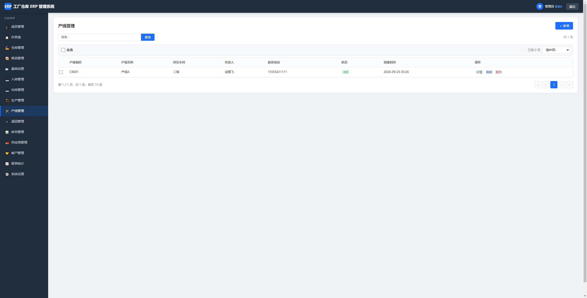 | 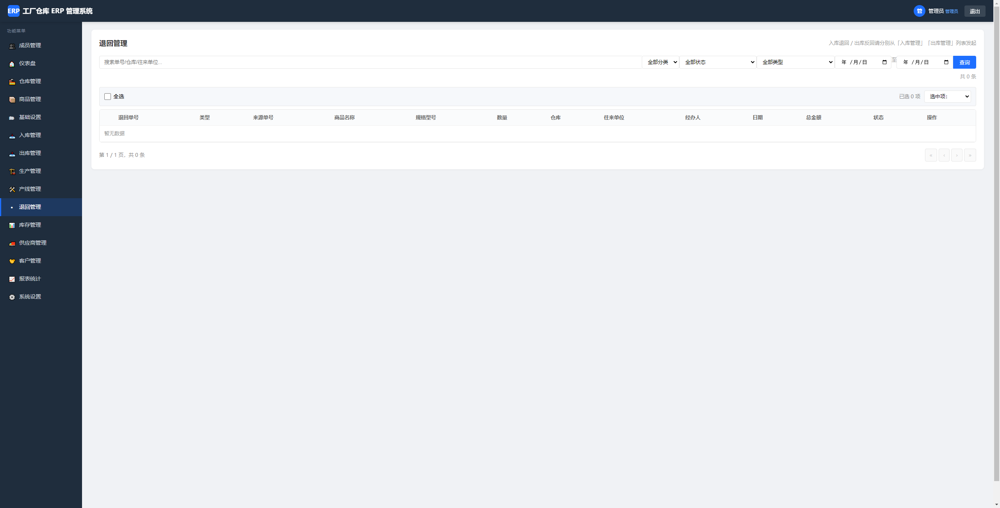 |

| 库存管理 | 报表统计 |
| --- | --- |
| 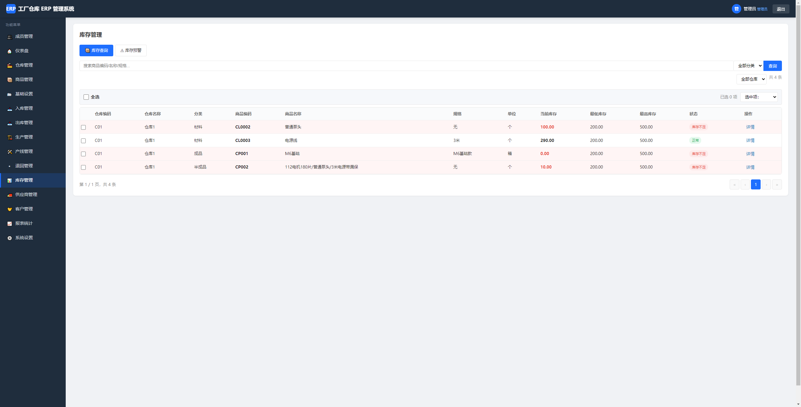 | 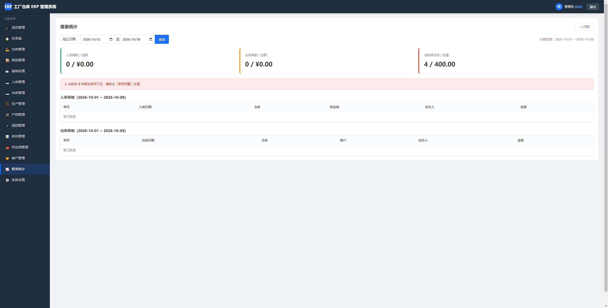 |

| 仓库管理 | 商品管理 |
| --- | --- |
| 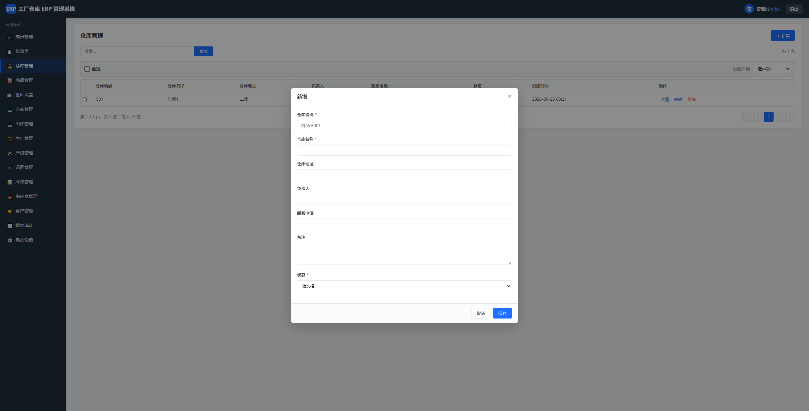 | 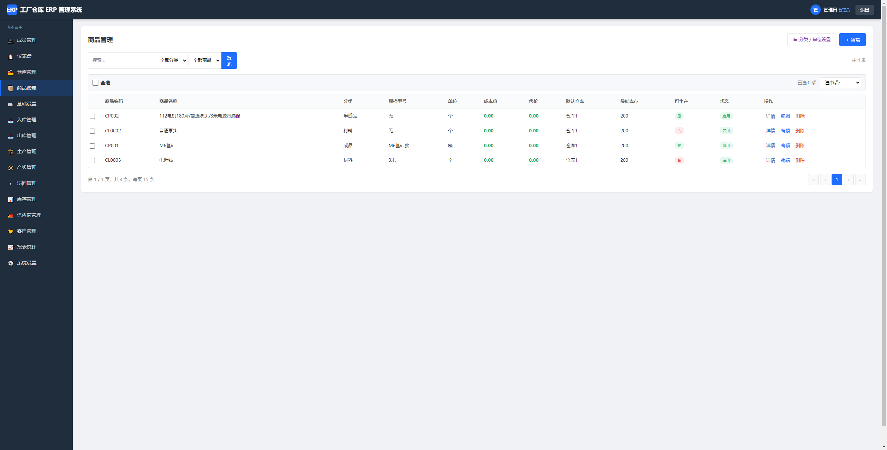 |

| 供应商管理 | 客户管理 |
| --- | --- |
|  | 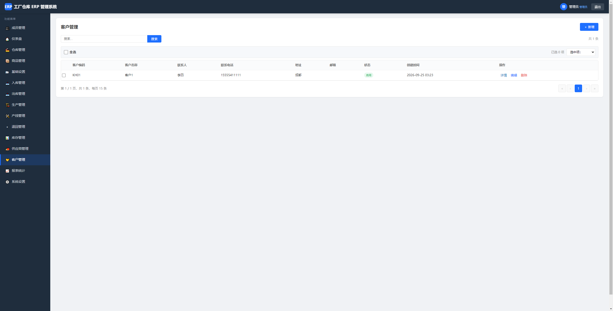 |

| 成员管理 | 基础设置 |
| --- | --- |
| 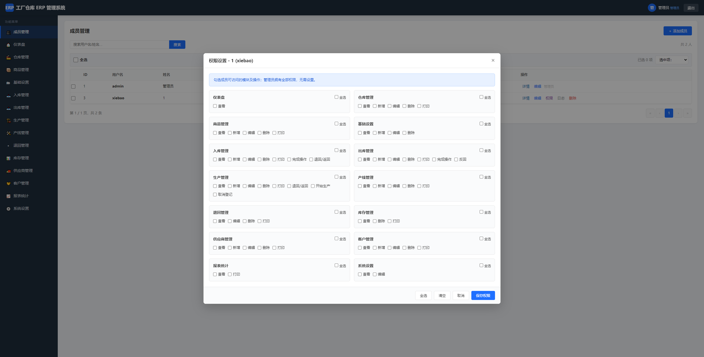 | 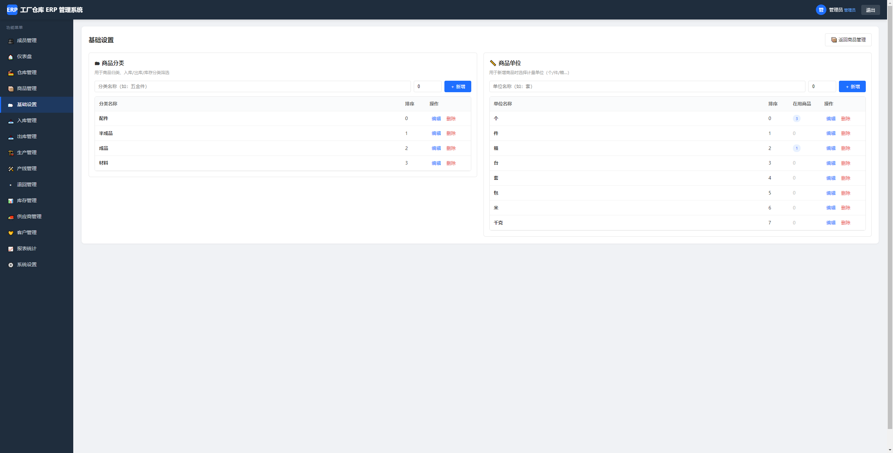 |

| 系统设置 | 打印 |
| --- | --- |
| 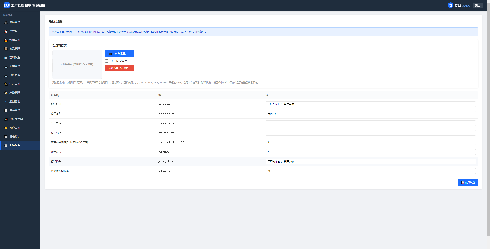 | 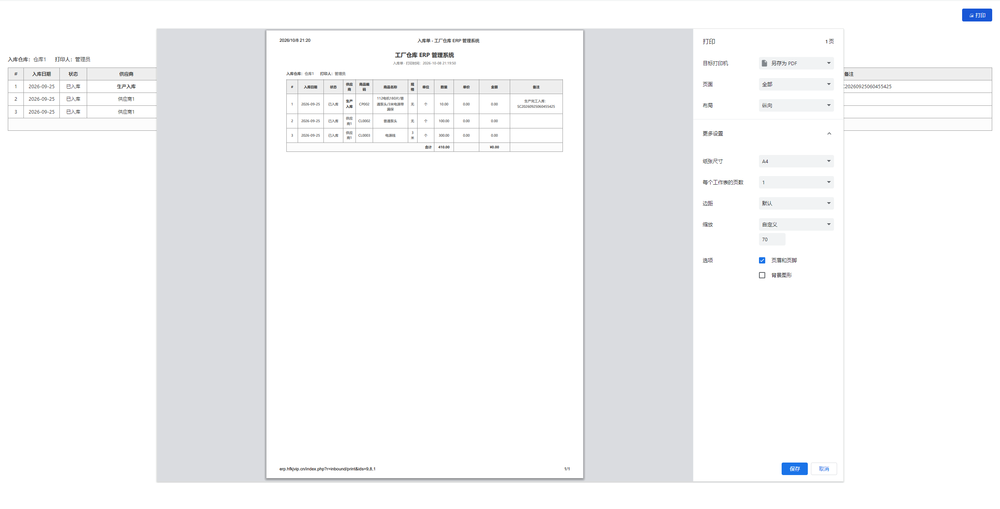 |

---

## 一、技术栈

| 项目 | 说明 |
| --- | --- |
| 后端 | PHP 8.2（不使用复杂框架，原生 OOP 结构） |
| 数据库 | MySQL 5.7+ / MariaDB 10.3+ |
| 前端 | 原生 HTML / CSS / JavaScript（无构建步骤） |
| 字符集 | UTF-8（utf8mb4） |
| 时区 | Asia/Shanghai |

充分使用 PHP 8.2 特性：`declare(strict_types=1)`、只读属性、联合类型、命名参数、枚举式匹配（`match`）、`readonly` 等。

---

## 二、环境要求

| 项目 | 要求 |
| --- | --- |
| PHP | **8.2.0 及以上** |
| 扩展 | `pdo_mysql`、`mbstring`、`openssl`（会话安全随机） |
| 数据库 | MySQL 5.7+ 或 MariaDB 10.3+ |
| Web 服务器 | Nginx / Apache / IIS 均可（推荐 Nginx + PHP-FPM） |
| PHP 配置 | `session` 可写、`date.timezone = Asia/Shanghai` |

如使用 Apache，已提供 `.htaccess`；如使用 Nginx，参考下方配置。

---

## 三、项目结构

```
erp/
├── index.php              # 前端控制器入口
├── install.php            # 部署引导（首次访问运行）
├── .htaccess              # Apache 伪静态（可选）
├── web.config             # IIS 伪静态（可选）
├── README.md              # 本文件
├── config/
│   ├── config.example.php # 配置示例
│   └── config.php         # 安装后自动生成（含数据库连接信息，请勿手动修改）
├── core/                  # 核心层（无需修改）
│   ├── Bootstrap.php      # 路由分发
│   ├── Auth.php           # 登录/会话
│   ├── BaseController.php # 控制器基类（渲染、CSRF、权限、分页）
│   ├── BaseCrudController.php # 配置驱动通用 CRUD
│   ├── Database.php       # PDO 单例（预处理防注入）
│   ├── Permission.php    # 模块级+操作级权限
│   ├── Csrf.php           # CSRF 令牌
│   └── helpers.php        # 全局辅助函数
├── app/
│   └── Controllers/       # 业务控制器
│       ├── AuthController.php        # 登录/退出/权限拒绝
│       ├── DashboardController.php   # 仪表盘
│       ├── UserController.php        # 成员管理+权限设置
│       ├── WarehouseController.php   # 仓库
│       ├── ProductController.php     # 商品
│       ├── SupplierController.php    # 供应商
│       ├── CustomerController.php    # 客户
│       ├── InboundController.php     # 入库（含明细+库存联动）
│       ├── OutboundController.php    # 出库（含明细+库存扣减+校验）
│       ├── ProductionController.php  # 生产方案(BOM)+生产任务（完工自动生成领料出库单+成品入库单）
│       ├── LineController.php        # 产线档案（负责人，生产任务下发目标）
│       ├── InventoryController.php   # 库存查询+预警
│       ├── ReturnController.php      # 退回管理（独立退货单）
│       ├── ReportController.php      # 报表统计
│       └── SettingsController.php    # 系统设置
├── views/                 # 视图模板（PHP 原生）
│   ├── layout/main.php    # 后台布局（顶栏 + 侧边栏）
│   ├── auth/              # 登录/权限拒绝
│   ├── dashboard/
│   ├── users/             # 成员管理（含权限设置弹窗）
│   ├── crud/              # 通用 CRUD 视图（被仓库/商品/供应商/客户复用）
│   ├── inbound/
│   ├── outbound/
│   ├── production/       # 生产任务 + 生产方案（BOM）
│   ├── inventory/
│   ├── return/
│   ├── report/
│   └── settings/
├── public/                # 静态资源
│   ├── css/style.css
│   └── js/app.js          # Toast、Modal、Ajax、CRUD 绑定
├── database/
│   └── schema.sql         # 数据库结构（由 install.php 自动执行）
└── storage/logs/          # 错误日志（运行时生成）
```

---

## 四、部署步骤

### 1. 上传代码
将整个项目目录上传到服务器 Web 根目录（如 `/var/www/html/erp` 或 `D:\www\erp`）。

### 2. 设置目录权限
- `config/` 目录需 PHP 可写（安装时写入 `config.php`）
- `storage/logs/` 目录需 PHP 可写（运行时记录错误日志）

Linux 命令示例：
```bash
chmod -R 755 /var/www/html/erp
chmod 777 /var/www/html/erp/config
chmod 777 /var/www/html/erp/storage/logs
```

### 3. 首次访问
浏览器打开网站根目录地址，例如 `http://your-domain/erp/`。
若未检测到 `config/config.php`，系统自动跳转到部署引导 `install.php`：

1. **第一步**：填写数据库地址 / 端口 / 库名（不存在自动创建）/ 用户名 / 密码
2. **第二步**：填写管理员用户名 / 密码 / 姓名
3. 点击「开始部署」→ 自动建库建表 + 创建管理员 + 写入配置
4. 成功后点击「进入登录页面」即可使用

### 4. 部署完成后
- **强烈建议删除 `install.php`** 防止再次被访问泄露配置
- 配置文件 `config/config.php` 包含数据库密码，请确保目录不可被外部下载

---

## 五、Web 服务器配置

### Nginx（推荐）
```nginx
server {
    listen 80;
    server_name your-domain.com;
    root /var/www/html/erp;
    index index.php;

    # 静态资源
    location /public/ {
        try_files $uri =404;
    }

    # 任何路由都由 index.php 处理
    location / {
        try_files $uri $uri/ /index.php?$query_string;
    }

    location ~ \.php$ {
        fastcgi_pass unix:/var/run/php/php8.2-fpm.sock;  # 按实际调整
        fastcgi_index index.php;
        fastcgi_param SCRIPT_FILENAME $document_root$fastcgi_script_name;
        include fastcgi_params;
    }

    # 禁止访问敏感目录
    location ~ ^/(config|core|app|database|storage)/ {
        deny all;
    }
}
```

> 提示：即使不配置伪静态，系统也支持 `index.php?r=Controller/method` 形式访问，便于开发调试。

### Apache
项目已附带 `.htaccess`，开启 `mod_rewrite` 即可。也可直接使用 `index.php?r=...` 访问。

### IIS
项目附带 `web.config`，导入到 IIS 站点即可。

---

## 六、系统功能与使用说明

### 6.1 登录管理
- 访问任意页面，未登录自动跳转到登录页
- 输入管理员账号 / 密码登录
- 点击右上角「退出」可注销当前会话

### 6.2 成员账号管理（仅管理员）
路径：「成员管理」
- **新增成员**：弹窗填写用户名 / 密码 / 姓名 / 电话 / 角色 / 状态
- **编辑成员**：弹窗加载原数据修改；密码留空表示不修改
- **删除成员**：弹出二次确认；管理员账号不可删除；不能删除自己
- **权限设置**：弹窗分组展示模块（仓库/商品/入库/出库/生产/产线/退回/库存/供应商/客户/报表/系统设置）与操作（查看/新增/编辑/删除/打印）；支持「模块全选」与「全选/清空」快捷按钮
- **细粒度操作权限**（可独立勾选、单独分配）：
  - 入库管理：`完成操作`=待入库单点「已完成」入库；`退回/返回`=已入库单发起「退回」
  - 出库管理：`完成操作`=待出库单点「已完成」出库；`反回`=已出库单发起「反回」
  - 生产管理：`开始生产`=开始生产/完成生产；`取消登记`=登记取消生产（待取消）；`退回/返回`=确认取消（执行材料返回仓库/成品退回扣减）
- **权限日志**：每次保存权限自动记录到 `permission_logs`（操作人、前后权限 JSON、按模块的变更摘要）；成员列表「日志」按钮可查看最近 50 条
- 权限实时生效：每次请求均从数据库读取成员最新权限，调整保存后该成员下一次操作即按新权限控制
- 成员登录后菜单仅显示有权限的模块

### 6.3 仓库 / 商品 / 供应商 / 客户
通用 CRUD 列表：
- 表格分页显示 + 关键字搜索
- 新增 / 编辑：弹窗表单
- 删除：二次确认
- 打印：新窗口打开打印预览，保留表格格式
- 商品可关联默认仓库、设置成本价/售价/最低库存（用于预警）
- 商品可标记「是否可生产」，标记为可生产后才能在生产管理中下达任务；列表支持按可生产筛选；被生产方案引用的商品不可删除

### 6.4 入库管理
- 新增入库单：弹窗填写入库仓库 / 供应商 / 经办人 / 日期 + 动态明细行（商品 / 数量 / 单价 / 金额自动计算）；明细商品下拉**不显示「可生产」商品**（成品由生产完工自动入库）
- 商品 / 供应商 / 客户选择框为**可搜索下拉**：点击展开后顶部即搜索框，输入关键字即时筛选选项
- 选择商品时自动回填成本价为默认单价
- **待办流程**：新单默认「待入库」，保存时不影响库存；列表中待入库单显示「已完成」按钮，点击后在同一事务内实际增加库存并变为「已入库」
- 编辑 / 删除已入库单时自动回滚库存
- 由生产完工自动生成的「生产入库」入库单在列表/打印中有专门标识，只能在生产管理中随任务维护，入库模块不可直接编辑、删除或手动完成
- **入库退回**：已入库的普通单据（非生产入库）列表显示「退回」按钮，弹窗按本单明细填写退回数量（不能大于本单数量 − 已退数量，含待办中的退回）；登记后生成「待退回」单，不立即扣库存，需到退回管理点「已完成」才退回供应商并扣减库存；列表与状态区显示待退回 / 已退回数量
- 支持查看（打印单张）与列表打印

### 6.5 出库管理
- 结构同入库，客户替代供应商
- **待办流程**：新单默认「待出库」，保存时不扣库存；列表点「已完成」时先预检库存，通过后在同一事务内实际扣减并变为「已出库」
- 库存不足则阻止完成并提示哪些商品不足
- 编辑时支持重新校验库存（已先回滚再检查新增需求）
- 删除已出库单时自动回滚（加回）库存
- 由生产任务自动生成的「生产领料」出库单在列表/打印中有专门标识，只能在生产管理中随任务维护，出库模块不可直接编辑、删除或手动完成
- **出库反回**：已出库的普通单据（非生产领料）列表显示「反回」按钮，弹窗按本单明细填写反回数量（不能大于本单数量 − 已反回数量，含待办中的反回）；登记后生成「待反回」单，不立即加库存，需到退回管理点「已完成」才把商品加回仓库；列表与状态区显示待反回 / 已反回数量

### 6.6 生产管理
- 页内双 Tab：**生产任务** 与 **生产方案（BOM）**
- 产线档案在独立的「产线管理」模块维护（界面与仓库管理一致：产线编码/名称/所在车间/负责人/电话/状态），被生产任务引用的产线不可删除
- 下达生产任务必须选择**目标产线**（仅启用产线），任务列表与打印单显示产线及其负责人，实现生产任务下发到产线
- 生产方案：维护每个可生产商品每生产 1 件成品所需消耗的材料、单位用量与单位；方案弹窗以**多材料明细表**一次性添加多种消耗商品（可增删行），选择材料后自动显示该商品全部仓库的当前库存**仅供参考**——配置方案本身不校验库存，同一成品下材料不可重复；编辑时按成品整表维护，已停用材料会被标记；实际库存校验在下达生产任务时按领料仓库执行
- 下达生产任务：仅能选择标记为「可生产」的商品；必须选择**领料仓库**与**成品入库仓库**；选择后系统自动查询生产方案并展开消耗明细（单位用量 × 生产数量），实时显示各材料当前库存与成本合计（库存仅供参考，开始生产时才强校验）
- **任务状态机：0 待生产 → 2 生产中 → 1 已完成；另有 3 已取消（取消数量减到 0 自动完结）**，库存动作分两步发生：
  - 列表「开始生产」（或弹窗直接保存为生产中）：待生产 → 生产中，在**同一事务**内校验材料库存 → 按方案从领料仓库扣减材料并生成「生产领料」出库单；**成品此时不入库**；库存不足会阻止开始
  - 列表「完成生产」：仅生产中任务可操作 → 已完成；存在「待取消」记录时阻止，需先确认取消；成品按当前生产数量（已扣除确认取消量）入成品入库仓库并生成「生产入库」入库单；成功后可一键跳转两张单据
- **取消生产**：待生产/生产中/已完成任务列表均可「取消生产」，填写取消数量（不能大于当前生产数量），弹窗按取消量/当前数量比例实时预览每种消耗材料的退回数量与取消后的生产数量；登记后生成「待取消」单（CX 单号，暂不动库存），列表点「确认取消」后生效：
  - 生产数量同步扣减；数量减为 0 时任务自动变为「已取消」
  - 待生产任务：尚未领料，仅扣减生产数量，不涉及库存
  - 生产中任务：消耗材料按比例退回领料仓库
  - 已完成任务：消耗材料退回领料仓库，同时从成品入库仓库扣减生产商品数量（成品库存不足会阻止）
  - 退回的材料（出库反回）与扣减的成品（入库退回）会**同步生成已完成的退回单到退回管理台账**（按确认取消时的任务状态标记「生产中取消」或「完成后取消」，关联来源领料/入库单，仅作记录不可在退回管理删除；删除生产任务时自动一并清理）；**待生产任务取消不生成退回台账**（尚未领料，无库存变动）
  - 同步扣减「生产领料」出库单明细数量（出库管理显示实际领料量）与「生产入库」入库单成品数量（入库管理显示实际入库量），单据总金额同步重算
  - 同一任务同一时间只允许一张待取消单；有取消记录的任务不可编辑；删除任务时按扣减后的领料/入库单当前数量回滚，保证库存不多退不少退
- 编辑任务：已完成先回滚完工入库单（成品扣回，库存不足会阻止）与领料出库单（材料加回），生产中先回滚领料出库单；保存为生产中时按新明细重新领料出库，保存为待生产则不涉及库存；删除任务按当前状态同样回滚
- 任务保存消耗材料快照，事后修改方案不影响历史任务；支持单张查看打印与列表打印（含领料/入库仓库与两张关联单号）

### 6.7 库存管理 + 预警
- 「库存查询」标签：以商品为主表关联库存，**新商品创建后立即显示**（未入库时库存为 0、仓库显示「未入库」）；按仓库 / 商品关键字搜索，分页显示
- 「库存预警」标签：自动列出库存低于商品最低库存（或全局阈值）的商品，红色标记；**无库存记录的新商品按 0 库存参与预警**
- 支持按仓库过滤；支持打印库存清单与预警清单
- 全局阈值在「系统设置」中配置（值=0 表示按商品最低库存）

### 6.8 退回管理
- 退回 / 反回的**待办中心**，不支持手工新增独立单据：入库退回从「入库管理」列表发起，出库反回从「出库管理」列表发起
- 列表显示来源入库单 / 出库单（可点击跳转），并按类型展示「待退回/已退回」「待反回/已反回」状态
- **待办流程**：来源单登记后为待办，不影响库存；列表点「已完成」后才实际变动库存
- 出库反回（客户退货入仓）：完成时商品加回仓库
- 入库退回（退回供应商）：完成时商品扣减仓库库存并预检库存不足
- 删除已完成单据时自动按原方向回滚库存
- 支持单张查看打印与列表打印（打印单显示来源单号）

### 6.9 报表统计
- 选择起止日期，查询入库 / 出库 / 库存汇总卡片
- 入库明细与出库明细表格
- 库存预警数提示
- 支持打印

### 6.10 系统设置
- 表格列出所有键值设置（站点名称 / 公司名称 / 公司电话 / 公司地址 / 库存预警阈值 / 货币符号 / 打印抬头）
- 直接修改值后保存即可生效

---

## 七、安全机制

| 风险 | 防护措施 |
| --- | --- |
| SQL 注入 | 全部使用 PDO 预处理（`PDO::ATTR_EMULATE_PREPARES = false`） |
| XSS | 输出统一使用 `e()` 函数（`htmlspecialchars`） |
| CSRF | 所有 POST/PUT/DELETE 自动校验 `_csrf_token`，前端通过 `X-CSRF-TOKEN` 头携带 |
| 密码哈希 | 使用 `password_hash` + `PASSWORD_DEFAULT`，登录时自动升级过期哈希 |
| 会话安全 | HttpOnly / SameSite=Lax / 自动 `session_regenerate_id` |
| 路由保护 | 反射校验方法可见性，禁止下划线开头方法被路由 |
| 权限校验 | 后端每个方法按 `module/action` 校验；管理员账号不可删除 |
| 错误输出 | 生产关闭 `display_errors`，错误写入 `storage/logs/error.log` |
| 配置文件 | 安装后 `config/config.php` 含敏感信息，Nginx 已配置禁止访问 |

---

## 八、数据库结构概览

详见 `database/schema.sql`，主要表：

| 表 | 说明 |
| --- | --- |
| `users` | 系统账号（is_admin=1 为管理员，permissions 存 JSON） |
| `warehouses` | 仓库 |
| `products` | 商品（含成本/售价/最低/最高库存、is_producible 是否可生产） |
| `suppliers` | 供应商 |
| `customers` | 客户 |
| `inbound_orders` / `inbound_items` | 入库单主表+明细（production_id 关联生产完工入库单） |
| `outbound_orders` / `outbound_items` | 出库单主表+明细（production_id 关联生产任务） |
| `production_boms` | 生产方案 BOM（成品 → 消耗材料及单位用量） |
| `production_orders` / `production_items` | 生产任务单主表（含目标产线、成品入库仓库、领料出库单/完工入库单ID；0待生产 2生产中(已领料) 1已完成）+消耗材料快照 |
| `production_lines` | 产线档案（含负责人，生产任务下发目标） |
| `production_cancels` / `production_cancel_items` | 生产取消单（CX 单号，0待取消 1已取消）+按比例退回材料明细快照 |
| `return_orders` / `return_items` | 退回/反回单主表+明细（return_type 1出库反回 2入库退回，source_id 关联来源出库单/入库单；0待办 1已完成） |
| `inventory` | 库存（仓库+商品唯一） |
| `settings` | 系统设置键值 |
| `operation_logs` | 操作审计日志（预留） |

> 如需手动初始化数据库（不通过 install.php），可直接导入 `database/schema.sql` 并手动插入一条管理员记录（密码用 `password_hash`）。

---

## 九、常见问题

**Q1：部署后访问页面报 500 或数据库连接失败？**
- 检查 `config/config.php` 中的连接信息是否正确
- 检查 MySQL 是否允许远程连接（如数据库在另一台服务器）
- 查看 `storage/logs/error.log`

**Q2：忘记管理员密码？**
- 直接在数据库执行：
  ```sql
  UPDATE users SET password='新哈希' WHERE username='admin';
  ```
  其中 `新哈希` 由 PHP 生成：`echo password_hash('你的新密码', PASSWORD_DEFAULT);`

**Q3：如何重置系统重新部署？**
- 删除 `config/config.php`（或重命名）
- 删除或清空已初始化的数据库
- 重新访问 `install.php`

**Q4：成员登录后看不到菜单？**
- 管理员在「成员管理」→「权限」中为该成员勾选相应模块的「查看」权限

**Q5：能否迁移到新服务器？**
- 复制整个项目目录
- 导出原数据库 → 在新服务器导入
- 修改 `config/config.php` 中的数据库连接信息
- 确保 `storage/logs/` 可写

---

## 十、版本信息

- 版本：1.0.0
- 适用：工厂仓库 ERP 管理
- 语言：中文
- 许可：MIT License
- 作者：金鹏飞

如有疑问，请检查 `storage/logs/error.log` 排查问题。

---

## 十一、开源协议

本项目基于 [MIT License](LICENSE) 协议开源发布。

```
Copyright (c) 2026 金鹏飞 (Jin Pengfei)

任何人均可免费获得本软件及相关文档文件的副本，可不受限制地
使用、复制、修改、合并、出版、发行、再许可和/或销售本软件副本，
唯须在所有副本或主要部分中保留上述版权声明和本许可声明。

本软件按「现状」提供，不附带任何明示或暗示的担保。
```

完整协议文本见 [LICENSE](LICENSE) 文件。
